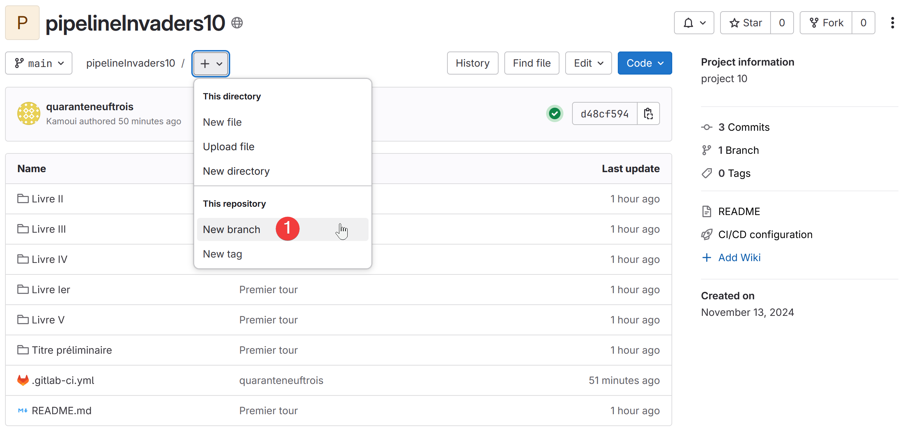
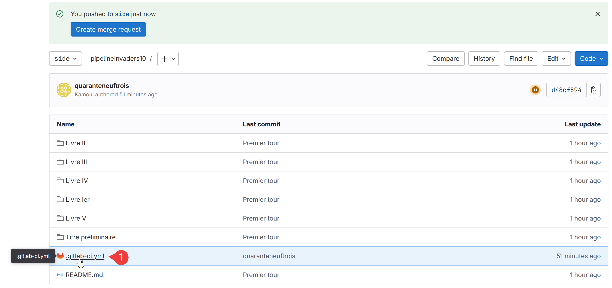
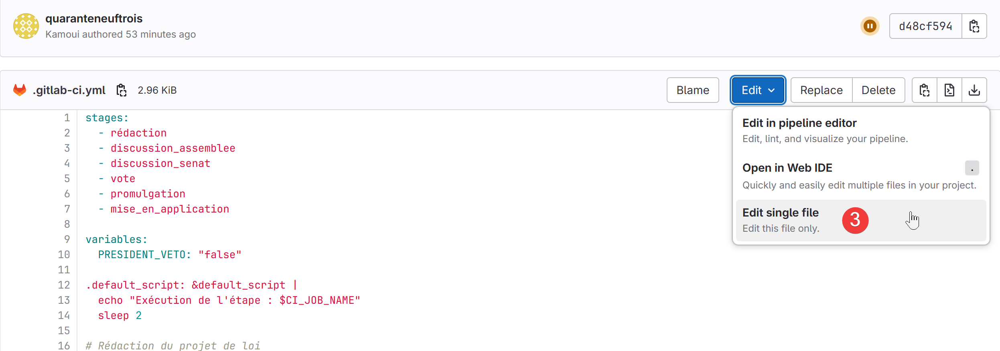
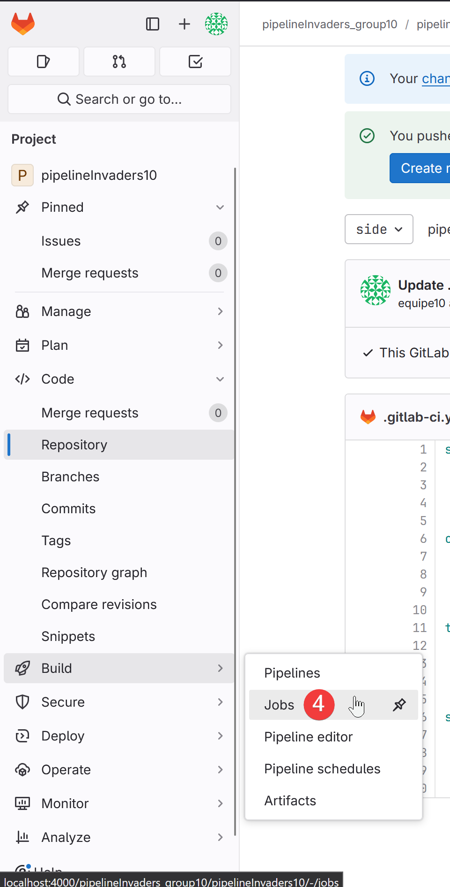
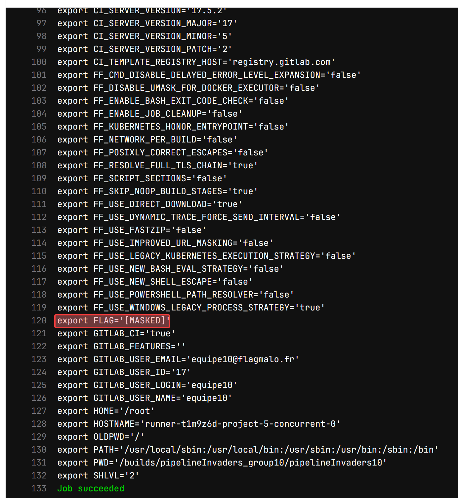
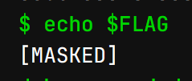
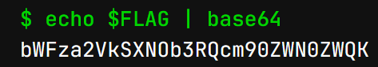
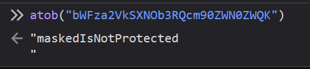

# PipelineInvaders - WU

> Ce challenge met en lumière une problématique de sécurité dans les environnements CI/CD concernant la gestion et la protection des variables secrètes dans un dépôt. 
> 
> Plusieurs approches étaient possibles pour résoudre le challenge ; ici, nous explorerons une méthode accessible via l'interface graphique de GitLab. 
> 
> Ce write-up s’inspire de l’attaque de l'exécution de pipeline empoisonnée (PPE), décrite dans la liste OWASP des risques de sécurité CI/CD.
>
> Référence OWASP : [CICD-SEC-4: Exécution de Pipeline Empoisonnée (PPE)](https://owasp.org/www-project-top-10-ci-cd-security-risks/CICD-SEC-04-Poisoned-Pipeline-Execution)

---

## Étapes de Résolution

### 1. Analyse Initiale du Dépôt

En explorant le dépôt, nous constatons rapidement que celui-ci ne contient pratiquement aucun code utile. L'élément exploitable se trouve dans le fichier `.gitlab-ci.yml`, qui est utilisé pour configurer la pipeline CI/CD de GitLab. Ce fichier est essentiel pour notre approche, car il permet de personnaliser les étapes d'exécution de la pipeline.

Nous observons également que la branche principale (`main`) est protégée, ce qui nous empêche d'y faire directement des modifications. Une solution consiste donc à créer une nouvelle branche.



### 2. Modification du Fichier `.gitlab-ci.yml`

Après avoir créé une nouvelle branche, nous passons à l'édition du fichier `.gitlab-ci.yml`. Ce fichier contient la configuration de la pipeline, ce qui nous permet de définir les actions à exécuter lors des différents stages du processus CI/CD.




### 3. Recherche des Variables d'Environnement

Pour progresser dans le challenge, nous devons accéder aux variables d'environnement du dépôt. Ces variables peuvent inclure des informations sensibles, comme des clés API ou des identifiants secrets.

Afin de lister toutes les variables d'environnement, nous ajoutons un job dans le fichier `.gitlab-ci.yml` avec la commande `export`, qui affiche toutes les variables d'environnement définies pour ce pipeline :

```yaml
# .gitlab-ci.yml

stages:
  - chercher

chercher:
  stage: chercher
  script:
    - export
```

Nous lançons ensuite la pipeline et allons consulter les logs de notre job "chercher" dans l'interface GitLab.



En sélectionnant le job "chercher", nous pouvons examiner les logs générés par l'exécution du script.



### 4. Localisation et Affichage du Flag

Parmi les nombreuses variables listées, nous identifions la variable `$FLAG`. Cependant, celle-ci est masquée dans les logs pour des raisons de sécurité.

Dans un premier temps, nous tentons d'afficher cette variable directement en ajoutant un `echo $FLAG` dans notre script. Malheureusement, cette méthode échoue car la variable reste masquée dans les logs.



Pour contourner cette protection, nous utilisons une technique simple mais efficace : encoder la variable en base64, ce qui permet de contourner la restriction de masquage et de voir sa valeur en clair.

```yaml
# .gitlab-ci.yml

stages:
  - solve

solve:
  stage: solve
  script:
    - echo $FLAG | base64
```

Lorsque nous relançons la pipeline avec ce nouveau script, la valeur encodée en base64 du flag apparaît correctement dans les logs.



### 5. Décodage du Flag

La dernière étape consiste simplement à décoder la valeur base64 obtenue pour retrouver le flag en texte clair. Une fois décodée, la variable révèle le flag final du challenge : `FMCTF{maskedIsNotProtected}`.



---

## Conclusion

Ce challenge montre que le masquage des variables dans les logs, bien que dissuasif, ne suffit pas à garantir leur sécurité. La présence de variables secrètes dans un fichier CI/CD peut constituer une faille de sécurité importante si celles-ci ne sont pas correctement protégées contre des utilisateurs non autorisés. 

### Ressources et Références :
- Challenge de référence : [cicd-goat](https://github.com/cider-security-research/cicd-goat/tree/main)

*Flag obtenu :* `FMCTF{maskedIsNotProtected}`